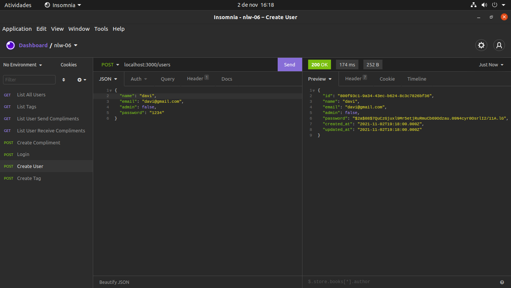
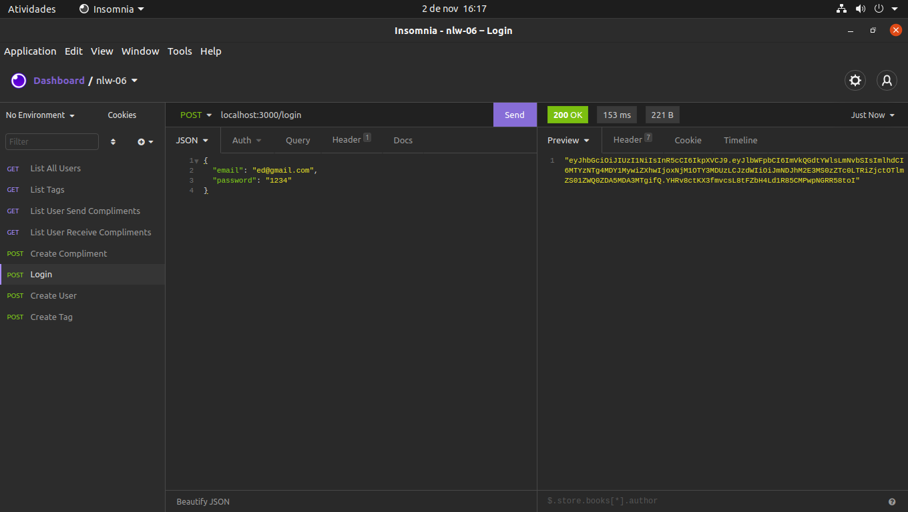
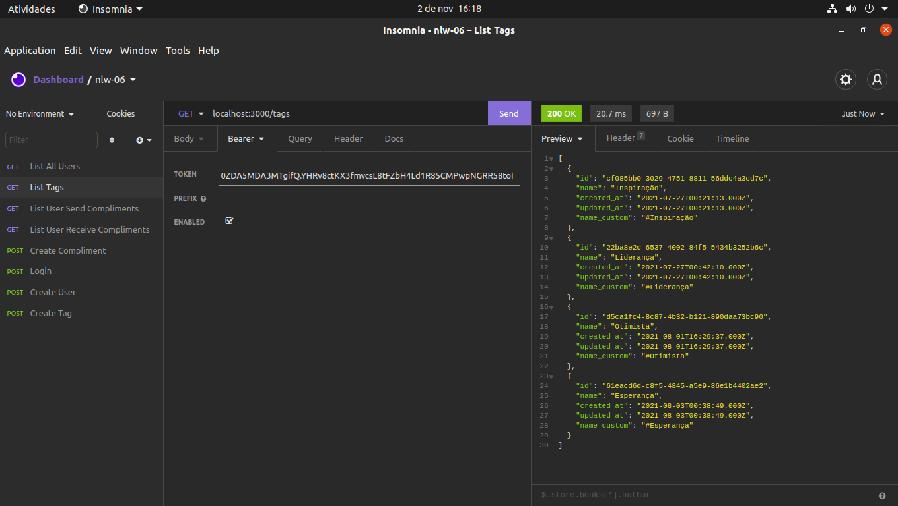
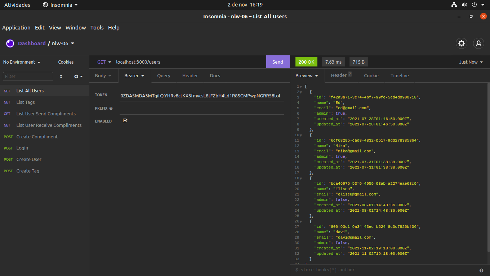

# Fórmulario multi etapas

# Imagens no insomnia

  
  
  
  

# Sobre este  projeto
A ideia do App é:

"Com o cenário caótico que em que o mundo está presente devido a pandemia, a ideia do app é trocar elogios, uma coisa que faz muita falta e que devido ao isolamento ficou cada vez mais raro".

# Algumas informações sobre esta API

1 - Este projeto, possui apenas o backend.
2 - Os usuários pode fazer elogios entre si, podendo utilizar uma tag ou criando uma.

# Funcionalidades

* Criar uma tag. Possui um validador, para que não repita as tags.
* Cadastrar na plataforma. Possuindo um validador de e-mail.
* Realizar elógios.

# Construido com:
* Nodejs - Utilizado para fazer a API da aplicação.
* Typescript - Foi utilizado por ser uma versão tipada do javascript, o que ajuda na hora de receber dados, evitando receber dados invalidos. Além de ser melhor na hora de realizar manutenção e na construção do sistema é bem mais prático e evita erros.
* express - Para fazer um servidor http em localhost e manipular as rotas.
* jsonwebtoken - Utilizado para gerar um token, assim que um usuário realiza login na plataforma, ele possui um prazo de validade.
* sqlite3 - Utilizado por ser um banco de dados mais leve e fácil de manusear para uma aplicação pequena.
* typeorm - Orm utilizado para manipular o banco de dados. Foi utilizado por quê mesmo que mude o banco de dados não precisa refazer todo o código, apenas a conexão.
* uuid - Para definir um hash único para as tags e usuários.
